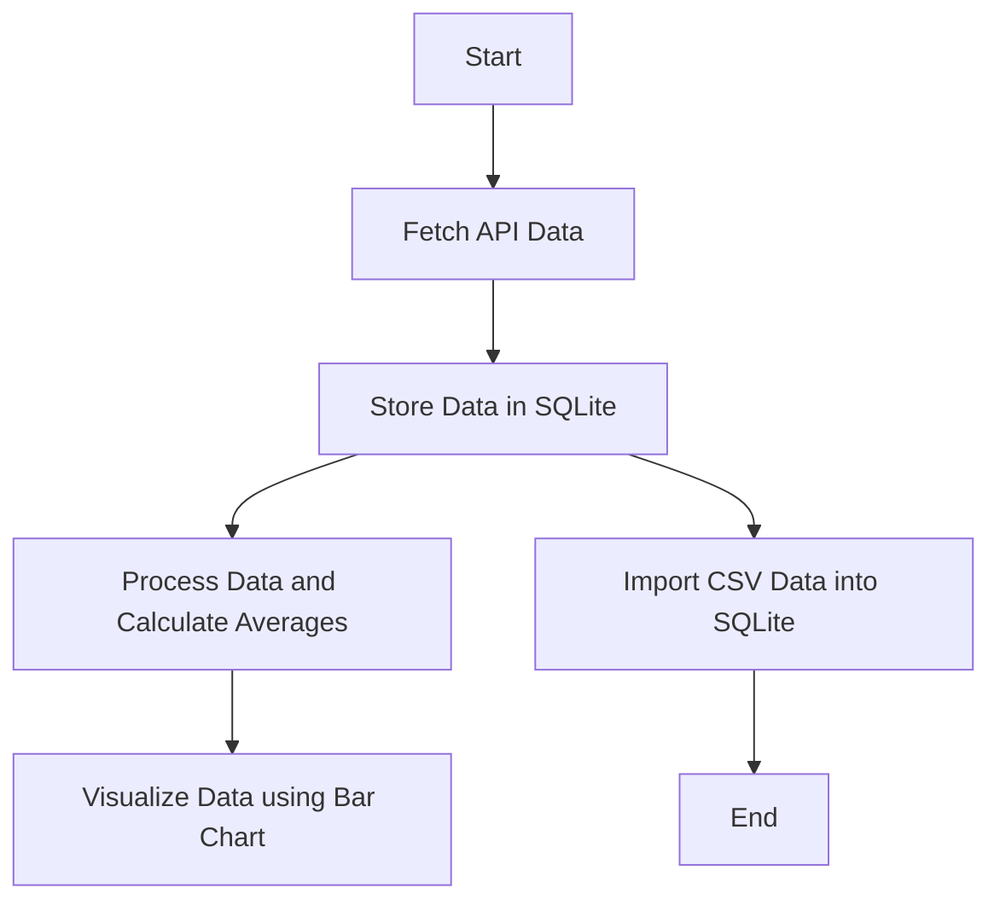

# AI/ML Assignment Repository

This repository contains solutions for two assignments focusing on **Python programming, API data handling, SQLite database operations, data visualization, and AI/ML concepts**.

---

## 📁 Project Structure

Accuknox_assignment/
│
├── Problem_statement_1/
│ ├── books_api.py
│ ├── students_scores.py
│ ├── csv_to_db.py
│ ├── database.db
│ ├── users.csv
│ ├── bar_chart_image.png
│ └── README.md
│
├── Problem_statement_2/
│ └──prajwal_kumar_assignment2

yaml
Copy code

---

## 🧩 Problem Statement 1

### 1. API Data Retrieval and Storage
- Fetch data from an external REST API providing a list of books in JSON format.
- Each book includes `title`, `author`, and `publication_year`.
- Store the retrieved data in a **SQLite database**.
- Display the stored records.

---

### 2. Data Processing and Visualization
- Fetch a dataset containing students’ test scores from an API.
- Calculate the **average score for each student**.
- Compute the **overall average score**, which is **84.88**.
- Visualize student scores using a **bar chart**.

#### Bar Chart of Students’ Average Scores
The computed average test score across all students is **84.88**.


---

### 3. CSV Data Import to SQLite
- Read user data (`name`, `email`) from a CSV file.
- Insert the records into a **SQLite database**.

---

## 🔁 Assignment 1 – Workflow




## 🧠 Problem Statement 2

### Approach Overview

This assignment focuses on understanding **LLM-based system design** and mapping **AI/ML concepts** to a real-world chatbot use case. The approach emphasizes:
- Evaluating current proficiency in LLM, AI, and ML concepts
- Understanding high-level system architecture for LLM-powered applications
- Identifying how vector databases support semantic search and retrieval
- Applying these concepts to a practical customer support chatbot scenario

 ## Problem Statement 2 – Workflow

```mermaid
flowchart TD
    A[Start] --> B[Self-Assessment of Skills]
    B --> C[Identify Strengths and Learning Areas]
    C --> D[Study LLM Architecture]
    D --> E[Define Chatbot Components]
    E --> F[Understand Vector Embeddings]
    F --> G[Choose Vector Database (FAISS)]
    G --> H[Map to Customer Support Chatbot]
    H --> I[Summarize Learnings]
    I --> J[End]
```

## 🛠️ Technologies Used

- Python 3.x  
- SQLite  
- Requests  
- Matplotlib  
- Mermaid (for flowcharts)

---

## ▶️ How to Run the Project

### 1. Clone the Repository
```bash
git 
cd Accuknox_assignment
```
### 2. Create and Activate Virtual Environment
```bash
python -m venv venv
venv\Scripts\activate
```

### 3. Install Dependencies
```bash
pip install -r requirements.txt
```

### 4. Run Individual Scripts
```bash
python books_api.py
python students_viz.py
python users_import.py
```